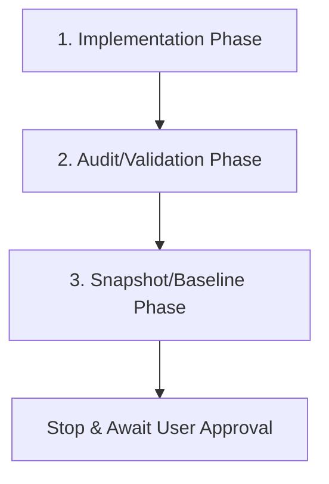

# Agent Skill 01 — Phase-Gate Lifecycle

This skill defines the sequence gates required to develop, audit, and baseline project phases.

## 1. The Phase Loop

For every development phase, the agent must execute the following sequential cycle:

1. **Implementation:** Write logic, format code, and compile tests.
2. **Audit:** Run verification commands (fmt checks, cargo check, integration tests, clippy checks, determinism, and leak tests) to confirm complete functionality without regression.
3. **Snapshot:** Write a persistent markdown snapshot file documenting status, file trees, verification outputs, and risks.

## 2. Gate Constraints

- **Never Auto-Advance:** Once a phase snapshot is completed, stop work. Do NOT proceed to implementing the next phase until the user explicitly requests it.
- **Stop on Unclear Scope:** If requirements are ambiguous, or if any compile/test error persists after three concrete fixing attempts, halt and request design direction from the user.
- **Execution Statuses:**
  - `success` — All validation steps pass and the snapshot is successfully written.
  - `blocked` — An issue prevents verification or the sandbox scope is invalid.
