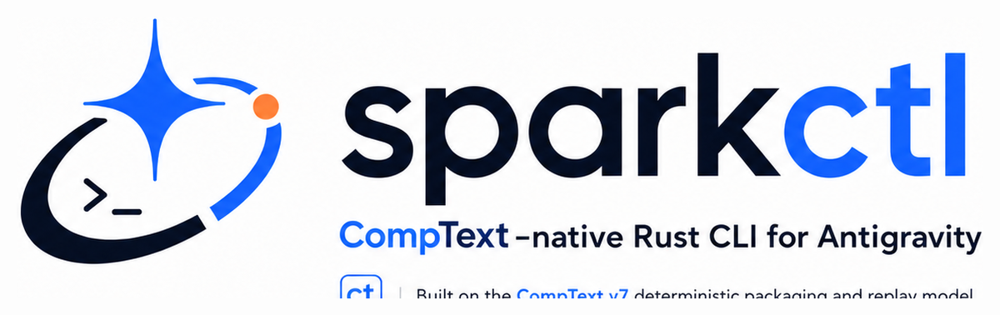

# Phase 5C Branding Asset Import Snapshot

## 1. Files Inspected
- [README.md](file:///C:/Users/contr/sandbox_workspace/Antigravity-Comptextv7-unified/git_post_push_verification/repo/README.md) (Modified and audited)
- [agy7rust/PHASE5C_STATUS.md](file:///C:/Users/contr/sandbox_workspace/Antigravity-Comptextv7-unified/git_post_push_verification/repo/agy7rust/PHASE5C_STATUS.md) (Created and audited)
- [assets/branding/sparkctl-logo.png](file:///C:/Users/contr/sandbox_workspace/Antigravity-Comptextv7-unified/git_post_push_verification/repo/assets/branding/sparkctl-logo.png) (Derived logo image)
- [assets/branding/sparkctl-logo-square.png](file:///C:/Users/contr/sandbox_workspace/Antigravity-Comptextv7-unified/git_post_push_verification/repo/assets/branding/sparkctl-logo-square.png) (Derived square icon)
- [assets/branding/sparkctl-wallpaper.png](file:///C:/Users/contr/sandbox_workspace/Antigravity-Comptextv7-unified/git_post_push_verification/repo/assets/branding/sparkctl-wallpaper.png) (Hero/wallpaper image)

## 2. Imported Asset Paths
- **Wide Logo**: `assets/branding/sparkctl-logo.png`
- **Square Logo**: `assets/branding/sparkctl-logo-square.png`
- **Wallpaper**: `assets/branding/sparkctl-wallpaper.png`

## 3. Asset Validation Result
- All assets are verified as local PNG files in the repository.
- File integrity checks confirm images are non-empty and readable.
- `sparkctl-logo.png` is cropped and formatted to 1200x378 pixels.
- `sparkctl-logo-square.png` is cropped and formatted to 1024x1024 pixels.
- `sparkctl-wallpaper.png` keeps its original hero role and visual layout (1672x941 pixels).
- No placeholder files were created, and no remote URLs are utilized.

## 4. README Logo Block Confirmation
The top of [README.md](file:///C:/Users/contr/sandbox_workspace/Antigravity-Comptextv7-unified/git_post_push_verification/repo/README.md) has been updated with the centered logo reference block:
```html
<p align="center">
  
</p>
```
The old "Branding assets pending" comment was successfully removed.

## 5. Status File Path Confirmation
- **Status File Location**: `agy7rust/PHASE5C_STATUS.md` exists and contains correct content.
- **Repository Root Check**: No misplaced status file duplicates are present at the root level.

## 6. Claim Hygiene Result
All updated README details conform to target guidelines:
- No claims of being "fully deterministic" are made.
- No claims of being "100% safe" are made.
- No claims of "no risks" are made.
- No statements claiming "official SPARK compatibility" are present.
- No EU AI Act compliance claims are made.

## 7. Safety Boundaries
- Offline behavior was deterministic in the validated test scope.
- Configured leak checks passed in the validated scope.

## 8. Known Limitations
- GitHub Actions status is verified through GitHub UI outside this local rollup.
- `handoff-check` is local repository readiness only and does not verify remote CI.
- No official SPARK compatibility claim is made.
- No compliance claim is made.

## 9. Risks
- No blocking risks found in the validated scope.

## 10. Next Recommended Phase
- Commit Phase 5C branding asset import changes only after approval.
