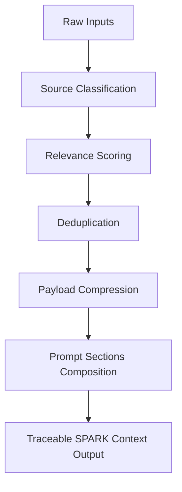

# Phase 6D.0 Agent-Control and Context Compiler Roadmap Handbook

## 1. Product Identity & Context Layer
**CompText-Sparkctl** serves as a deterministic context compilation, validation, and offline agent-control registry. The architecture focuses on managing and validating the intermediate states of administrative workflows, keeping replay-sensitive parameters isolated from lossy textual compression zones.

---

## 2. Context Compiler Design Pattern
The Context Compiler compiles structured raw trace inputs into tokens optimized for LLM contexts without losing replay-critical properties:



### Compiler Steps:
1. **Raw Inputs:** Captures administrative AI trace logs, database dumps, and tool calls.
2. **Source Classification:** Maps inputs to specific schemas, validation rules, or source engines.
3. **Relevance Scoring:** Ranks items based on temporal adjacency and role relevance.
4. **Deduplication:** Identifies and filters redundant status ticker or reasoning entries.
5. **Payload Compression:** Strips reasoning prose, formatting blocks, and conversational noise.
6. **Prompt Sections:** Structures the compressed text into distinct, token-light blocks.
7. **Traceable Output:** Emits the final context artifact with hash commitments for verification.

---

## 3. Agent Pipeline Model
Future implementations of the orchestrator will leverage a structured multi-step execution cycle:

```text
  PLAN -> CONTEXT -> EXECUTE -> VERIFY -> PATCH_OR_ANSWER
```

- **PLAN:** Formulate a sequential list of goals and tool invocations.
- **CONTEXT:** Compile necessary input states via the Context Compiler.
- **EXECUTE:** Execute tool calls and parse responses.
- **VERIFY:** Assert output formats, state changes, and schema constraints.
- **PATCH_OR_ANSWER:** Emit the answer on validation success, or patch/retry on validation error.

---

## 4. Future Role Model
To delegate responsibilities cleanly in downstream agent integrations, we define five roles:
- **Planner:** Generates and maintains execution steps.
- **Retriever:** Queries databases and constructs the input trace subset.
- **Executor:** Directly performs operations and interacts with tools.
- **Verifier:** Evaluates system outputs against schemas and leak bounds.
- **Summarizer:** Renders operational contexts into token-light textual summaries.

---

## 5. Future Structured Artifacts
Every run managed by the orchestrator yields a structured diagnostic artifact containing:
- `run_id`: Unique cryptographic execution identifier.
- `task`: High-level prompt or request template.
- `selected_context`: Inputs deemed relevant by the retriever and compiler.
- `discarded_context`: Irrelevant or pruned context inputs.
- `tool_calls`: Log of executed tools with arguments and return states.
- `validation_errors`: Integrity, schema, or leak violations encountered.
- `final_output`: Main outcome payload of the successful execution.

---

## 6. Future Event Model
The execution pipeline emits structured events for monitoring and piping:
- `run_started`: Emitted upon execution launch.
- `plan_created`: Emitted when the step checklist is finalized.
- `context_selected`: Emitted after compiling the target context.
- `tool_called`: Emitted before and after each tool invocation.
- `artifact_created`: Emitted when intermediate files are generated.
- `validation_failed`: Emitted on schema or leak check failures.
- `validation_passed`: Emitted on successful verification blocks.
- `final_output_created`: Emitted on execution success.

---

## 7. Relationship to `agy-ct`
The roadmap for `agy-ct` CLI capabilities proceeds in distinct phases:
- **Phase 6C (Current):** Safe compatibility wrappers mapping `doctor`, `validate`, `handoff`, `demo`, and `context all` commands.
- **Phase 6D (Next):** Automatic `run` and `demo` workflow orchestrator logic.
- **Phase 6E (Future):** Output formats (`--json`, `--plain`) and structured JSON report exporter.
- **Phase 6F (Future):** Local cache valve and optional NotebookLM source bundle exporter.

---

## 8. Architectural Boundaries
To maintain a tight scope and prevent feature creep:
- **No multi-agent scheduler:** All runs are single-thread workflow executions.
- **No worktree orchestration:** Code does not manage git checkout trees.
- **No AG-UI runtime:** The tool operates exclusively on the command-line.
- **No Pydantic AI integration:** No external Python-based LLM frameworks are integrated.
- **No subagent execution:** Orchestrator does not launch child AI processes.
- **No browser/control-plane UI:** The interface remains local and text-based.
- **No NotebookLM integration:** NotebookLM source bundling is deferred as optional and not currently required.

---

## 9. Safety, Leak & Claim Hygiene Guidelines
- **Wording Rules**:
  - Offline behavior was deterministic in the validated test scope.
  - Configured leak checks passed in the validated scope.
  - No blocking risks found in the validated scope.
- **Forbidden Claims**:
  - No claims of being "fully deterministic", "100% safe", or having "no risks" are present.
  - No claims of official SPARK JSON compatibility are made.
  - No claims of EU AI Act certification or compliance are made.
