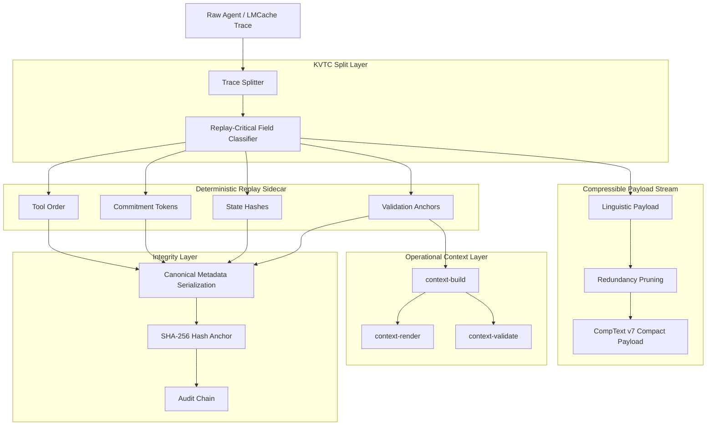
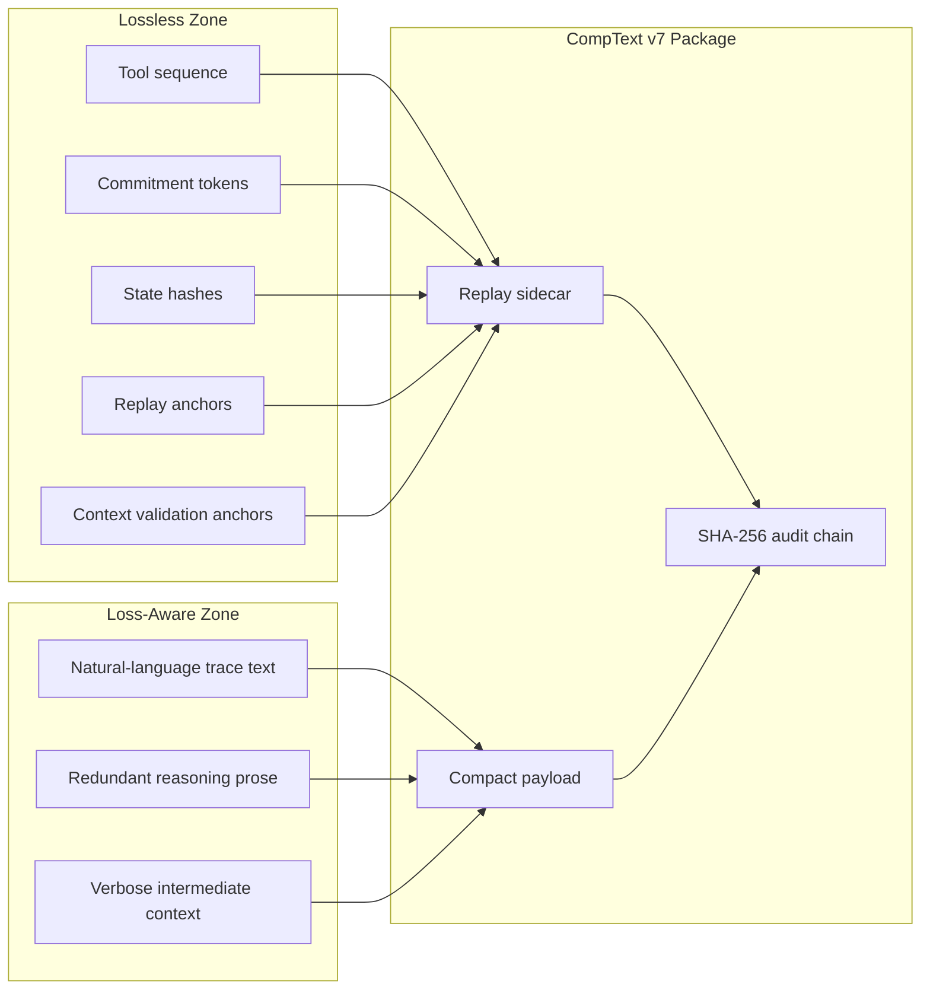

# sparkctl

## Antigravity-CompText v7 / SPARK Context Layer

<!-- Branding assets pending: assets/branding/sparkctl-logo.png -->

<div align="center">

[](https://github.com/ProfRandom92/Antigravity-Comptextv7/stargazers)
[](https://opensource.org/licenses/MIT)
[](https://www.python.org/)
[](https://www.rust-lang.org/)
[](#-security-model)
[](#-spark-hackathon-track)

**Deterministic trace compression and operational context validation for autonomous agent systems.**

</div>

---

## 🚀 Overview

`sparkctl` is the unified operations controller and command-line interface for the **Antigravity-CompText v7 / SPARK Context Layer**. It streamlines local diagnostics, codebase validation, pipeline lifecycle orchestration, and integration demonstrations under a clean, secure, and offline execution environment.

CompText v7 separates compressible linguistic payloads from replay-critical state, then reconstructs canonical traces with cryptographic sidecar integrity. The SPARK Context Layer provides offline Rust pipelines for packaging, schema validation, token-light rendering, and structured context checking.

Classic lossy trace compression fails when validators expect exact tool order, commitment tokens, state hashes, and canonical replay strings. CompText v7 avoids that failure mode by splitting each trace into two coordinated streams:

| Layer | Purpose | Target property |
|---|---|---|
| **CompText payload** | Pruned, compact linguistic trace | Lower token and transport cost |
| **Replay sidecar** | Tool sequence, commitments, hashes, state anchors | Deterministic reconstruction in the validated scope |
| **SHA-256 audit chain** | Integrity metadata over critical replay data | Tamper-sensitive validation |
| **Holdout validator** | Non-adaptive replay verification | Stable replay score in benchmark runs |

---

## 🛠 Command Surface

`sparkctl` consolidates all operations under a single command-line interface:

*   **`sparkctl doctor`**: Diagnoses local project readiness by verifying the presence of key configuration files, JSON schemas, and output artifacts.
*   **`sparkctl rust-validate`**: Automates execution of local crate quality checks (`cargo fmt`, `cargo check`, `cargo test`, `cargo clippy`).
*   **`sparkctl context-all`**: Coordinates the local context pipeline sequence (`context-build`, `context-render`, `context-validate`).
*   **`sparkctl spark-demo`**: Orchestrates the full end-to-end integration lifecycle (`compress`, `context-build`, `context-render`, `context-validate`).
*   **`sparkctl handoff-check`**: Validates file completeness and command availability to ensure clean repository handoff status.

---

## ⚡ Quickstart

To run `sparkctl`, navigate to the `agy7rust` directory and use `cargo run`:

```bash
cd agy7rust
cargo run --bin sparkctl -- doctor
cargo run --bin sparkctl -- rust-validate
cargo run --bin sparkctl -- context-all
cargo run --bin sparkctl -- spark-demo
cargo run --bin sparkctl -- handoff-check
```

### Artifact Outputs
The SPARK pipeline generates and validates the following key artifacts under `artifacts/spark/`:
- `artifacts/spark/extraction.spkg`: The deterministically compressed trace package containing payload and sidecar metadata.
- `artifacts/spark/context.json`: The compiled structured operational context mapping dependencies and security parameters.
- `artifacts/spark/context_render.txt`: The token-light rendered text view for verification and summarization.

---

## 🔒 Safety, Boundaries & Claim Hygiene

*   **Offline Execution:** All subcommands operate completely locally. Offline behavior was deterministic in the validated test scope.
*   **Leak Boundaries:** Configured leak checks passed in the validated scope.
*   **Local Handoff Checks:** `sparkctl handoff-check` validates local repository readiness and file availability only; it does not verify remote CI or GitHub Actions status.
*   **Compatibility:** No official SPARK compatibility claim is made.
*   **Compliance:** No compliance claim (such as EU AI Act compliance) is made.
*   **Risks:** No blocking risks found in the validated scope.

---

## 📈 Project Phase Status

*   **Phase 3 (Context Layer):** Build, Render, and Validate slices — **Complete**
*   **Phase 4 (sparkctl Command Surface):** `doctor`, `rust-validate`, `context-all`, `spark-demo`, and `handoff-check` subcommands — **Complete**
*   **Phase 5 (Release & Branding):** Release documentation & branding integration — **In Progress**

---

## 🏛 Architecture

CompText v7 is built around one hard rule: **payload compression must never destroy replay-critical state**.



### Compression contract



---

## 🦀 Rust Integration

Rust is integrated as the execution path for the parts that should be fast, deterministic in the validated scope, and easy to audit:

- byte-level payload handling
- deterministic hashing and verification
- replay-sidecar validation
- schema-sidecar validation
- operational context build/render/validate flows
- low-overhead execution inside local validation workflows

Python remains useful as the reference and experimentation layer. Rust is the direction for hardened execution.

---

## 🔒 Security Model

CompText v7 does not treat compression as a purely cosmetic optimization. Every replay-sensitive field is part of the integrity surface.

The sidecar protects:

- tool execution order
- commitment and control tokens
- final state hash
- replay metadata
- validation-critical anchors
- context validation anchors

If a compressed package is modified without updating the expected integrity chain, reconstruction fails loudly instead of producing a misleading replay.

Non-claims:

- no official SPARK compatibility claim
- no EU AI Act compliance claim
- no legal evidentiary-status claim
- no forensic certainty claim
- no MCP server capability
- no RAG, embeddings, vector database, or external tool-orchestration layer

---

## 📊 Benchmarks

Current validation targets are based on the existing CompText v7 benchmark profile:

| Group | Strategy | Avg. Payload | Replay Validity | Notes |
|---|---:|---:|---:|---|
| A | Raw baseline | 2023.9 bytes | 1.00 | No compression |
| B | CompText v7 | **744.4 bytes** | **1.00** | **63.2 % reduction** |
| C | Regex pruning | ~68 % of raw | 1.00 | No forensic integrity |
| D/E | Blind reduction | variable | 0.0 on complex traces | Loses temporal/state-critical tokens |

The design goal is not maximum textual compression at any cost. The goal is maximum safe reduction under strict deterministic replay constraints.

---

## 📦 Repository Map

```text
.
├── .agent/                 # Local agent skills used for gated implementation
├── .antigravitycli/        # Antigravity CLI/runtime configuration
├── Comptextv7/             # CompText v7 integration surface
├── agy7rust/               # Rust CLI path for SPARK-style packaging and context flows
├── artifacts/spark/        # Generated SPARK demo/package/context artifacts
├── benchmarks/             # Benchmark profiles and comparison material
├── core/                   # KVTC / replay core components
├── datasets/               # Fixtures and trace datasets
├── examples/spark/         # SPARK-style extraction fixtures and demo input
├── reports/                # Evaluation notes and generated reports
├── schemas/                # JSON schema sidecar fixtures
├── tests/                  # Holdout, replay, and integrity tests
└── README.md               # Project landing page
```

---

## 🤝 Contributing

Contributions are welcome. The project is especially interested in work that improves determinism, compression quality, auditability, Rust hardening, or SPARK-style administrative AI verification.

Good first contribution areas:

- add new trace fixtures
- add SPARK-style extraction fixtures
- improve benchmark coverage
- document edge cases
- add Rust-side validation tests
- tighten schema-sidecar checks
- improve CI reproducibility
- extend operational context validation while preserving leak boundaries

Contribution flow:

1. Fork the repository.
2. Create a feature branch: `git checkout -b feature/your-improvement`.
3. Make a focused change.
4. Run tests locally.
5. Open a pull request with a clear before/after explanation.

Please keep PRs small, reproducible, and validation-oriented.

---

## 🛣 Roadmap

- [x] Deterministic replay-sidecar architecture
- [x] SHA-256 integrity anchoring
- [x] Holdout-oriented validation profile
- [x] Rust execution path introduced
- [x] SPARK-style extraction package format
- [x] Schema-driven sidecar extraction
- [x] Offline SPARK demo fixtures
- [x] SPARK operational context model
- [x] SPARK context build/render/validate CLI flow
- [x] Unified CLI `sparkctl` (`doctor`, `rust-validate`, `context-all`, `spark-demo`, `handoff-check`)
- [ ] CI benchmark snapshots
- [ ] Fresh-clone GitHub verification workflow
- [ ] Public examples for custom trace datasets
- [ ] v8 generalization layer for enterprise agent pipelines

---

## 🌟 Support the project

If this project helps you reason about safer agent traces, compression, or deterministic replay, consider leaving a star. It makes the project easier to discover and helps attract contributors who care about reliable agent infrastructure.

---

## 📄 License

This project is released under the MIT License.

---

<div align="center">

**CompText v7: compress the noise, preserve the proof.**

</div>
