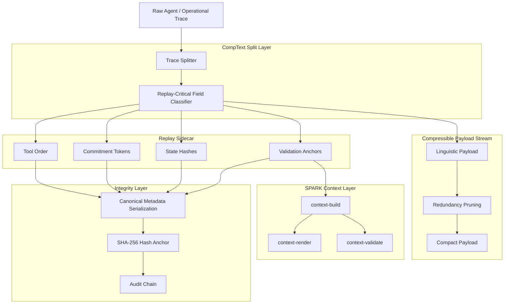
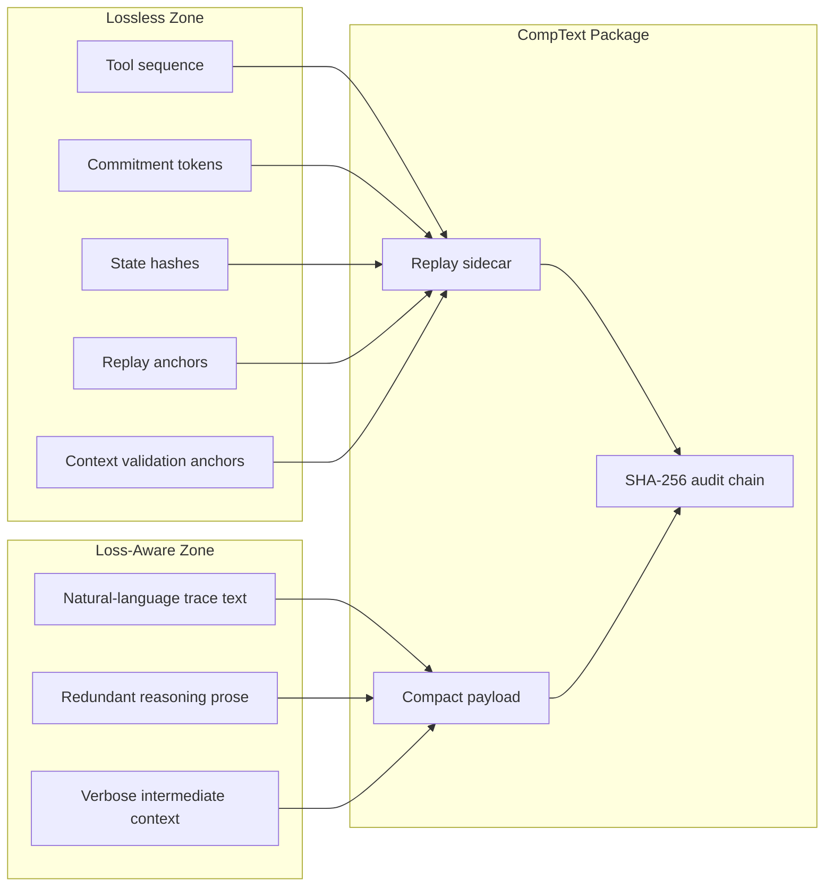

# CompText-Sparkctl

<div align="center">

**Deterministic Rust CLI for CompText trace packaging, replay-sidecar validation, and SPARK-style context artifacts.**


</div>

---

## Overview

**CompText-Sparkctl** is a local Rust command-line toolkit for turning agent or operational traces into compact, verifiable packages and SPARK-style context artifacts.

The project is built around one hard rule: **compression must not destroy replay-critical state**. CompText separates compact linguistic payloads from replay-sensitive metadata, then validates the result with a replay sidecar, SHA-256 integrity anchors, schema checks, and offline context validation flows.

The repository currently exposes two CLI entry points:

- `sparkctl` — the validated compatibility surface for local diagnostics, Rust validation, context pipeline checks, demo execution, and handoff checks.
- `agy-ct` — the newer CompText command surface, currently wired to safe compatibility wrappers for selected existing `sparkctl` functionality.

Previously, this project used the working name **Antigravity-CompText v7**. The current public project name is **CompText-Sparkctl**.

---

## What it does

CompText-Sparkctl validates the split between compressible trace content and replay-critical state:

| Layer | Purpose | Target property |
|---|---|---|
| **CompText payload** | Pruned, compact linguistic trace | Lower token and transport cost |
| **Replay sidecar** | Tool sequence, commitments, hashes, state anchors | Deterministic reconstruction in the validated scope |
| **SHA-256 audit chain** | Integrity metadata over critical replay data | Tamper-sensitive validation |
| **Holdout validator** | Non-adaptive replay verification | Stable replay score in benchmark runs |
| **SPARK context artifacts** | Structured operational context and rendered summaries | Local validation and handoff readiness |

Classic lossy compression fails when validators expect exact tool order, commitment tokens, state hashes, and canonical replay strings. CompText-Sparkctl keeps those replay-sensitive fields outside the lossy zone.

---

## Command Surface

### `sparkctl`

`sparkctl` is the validated operations controller:

```bash
cd agy7rust
cargo run --bin sparkctl -- doctor
cargo run --bin sparkctl -- rust-validate
cargo run --bin sparkctl -- context-all
cargo run --bin sparkctl -- spark-demo
cargo run --bin sparkctl -- handoff-check
```

Validated command responsibilities:

- `sparkctl doctor` checks local project readiness.
- `sparkctl rust-validate` runs local Rust quality checks.
- `sparkctl context-all` runs the local context build/render/validate sequence.
- `sparkctl spark-demo` runs the local end-to-end demonstration flow.
- `sparkctl handoff-check` checks local repository handoff readiness.

### `agy-ct`

`agy-ct` is the newer command surface for CompText-Sparkctl. It currently provides the command tree and safe compatibility wrappers without introducing a new run orchestrator.

```bash
cd agy7rust
cargo run --bin agy-ct -- --help
cargo run --bin agy-ct -- doctor
cargo run --bin agy-ct -- validate
cargo run --bin agy-ct -- handoff
cargo run --bin agy-ct -- demo
cargo run --bin agy-ct -- context all
```

Current wrapper mapping:

| `agy-ct` command | Existing validated backend |
|---|---|
| `agy-ct doctor` | `sparkctl::doctor::run_doctor()` |
| `agy-ct validate` | `sparkctl::rust_validate::run_rust_validate()` |
| `agy-ct handoff` | `sparkctl::handoff_check::run_handoff_check()` |
| `agy-ct demo` | `sparkctl::spark_demo::run_spark_demo()` |
| `agy-ct context all` | `sparkctl::context_all::run_context_all()` |

Other `agy-ct` commands remain explicit placeholders until their implementation phase is approved.

---

## SPARK Context Artifacts

The local SPARK-style demo and context pipeline generates and validates artifacts under `artifacts/spark/`:

- `artifacts/spark/extraction.spkg` — compact trace package containing payload and replay-sidecar metadata.
- `artifacts/spark/context.json` — structured operational context for validation and handoff.
- `artifacts/spark/context_render.txt` — token-light rendered context view for review and summarization.

These artifacts are intended for local, reproducible validation and review workflows.

### Demo Evidence

Demo evidence:
- SPARK challenge demo evidence: [DEMO_SPARK_EVIDENCE.md](file:///C:/Users/contr/sandbox_workspace/Antigravity-Comptextv7-unified/git_post_push_verification/repo/DEMO_SPARK_EVIDENCE.md)
- Local performance baseline: [PERFORMANCE_BASELINE.md](file:///C:/Users/contr/sandbox_workspace/Antigravity-Comptextv7-unified/git_post_push_verification/repo/PERFORMANCE_BASELINE.md)

#### Reviewer Quickstart

To execute the reviewer evidence flow and local/offline validation check:

```bash
cd agy7rust
cargo run --bin agy-ct -- run
cargo run --bin agy-ct -- benchmark
```

Benchmark output is local and environment-specific, and generated report files under `reports/` are not required to be committed. These commands generate and verify SPARK-style evidence artifacts.

---

## Architecture



### Compression contract



---

## Rust Integration

Rust is the hardened local execution path for components that need to be fast, auditable, and deterministic in the validated scope:

- byte-level payload handling
- deterministic hashing and verification
- replay-sidecar validation
- schema-sidecar validation
- operational context build/render/validate flows
- local CLI validation and handoff checks

Python remains useful as a reference and experimentation layer. Rust is the direction for hardened execution.

---

## Safety, Boundaries & Claim Hygiene

- **Offline execution:** Validated commands operate locally. Offline behavior was deterministic in the validated test scope.
- **Leak boundaries:** Configured leak checks passed in the validated scope.
- **Local handoff checks:** `sparkctl handoff-check` checks local repository readiness and file availability only; it does not verify remote CI or GitHub Actions status.
- **SPARK:** No official SPARK compatibility claim is made.
- **Compliance:** No compliance claim, including EU AI Act compliance, is made.
- **Risk statement:** No blocking risks found in the validated scope.

Non-claims:

- no legal evidentiary-status claim
- no forensic certainty claim
- no MCP server capability claim
- no RAG, embeddings, vector database, or external tool-orchestration layer
- no production-readiness, certification, or compliance claim

---

## Benchmarks

Current validation targets are based on the existing CompText v7 benchmark profile:

| Group | Strategy | Avg. Payload | Replay Validity | Notes |
|---|---:|---:|---:|---|
| A | Raw baseline | 2023.9 bytes | 1.00 | No compression |
| B | CompText v7 | **744.4 bytes** | **1.00** | **63.2 % reduction** |
| C | Regex pruning | ~68 % of raw | 1.00 | No forensic integrity |
| D/E | Blind reduction | variable | 0.0 on complex traces | Loses temporal/state-critical tokens |

The design goal is not maximum textual compression at any cost. The goal is maximum safe reduction under strict replay constraints.

---

## Repository Map

```text
.
├── .agent/                 # Local agent skills used for gated implementation
├── .antigravitycli/        # Local agent runtime configuration
├── Comptextv7/             # CompText v7 integration surface
├── agy7rust/               # Rust CLI path for packaging, validation, and context flows
├── artifacts/spark/        # Generated SPARK-style demo/package/context artifacts
├── assets/branding/        # Project branding assets
├── benchmarks/             # Benchmark profiles and comparison material
├── core/                   # KVTC / replay core components
├── datasets/               # Fixtures and trace datasets
├── examples/spark/         # SPARK-style extraction fixtures and demo input
├── reports/                # Evaluation notes and generated reports
├── schemas/                # JSON schema sidecar fixtures
├── tests/                  # Holdout, replay, and integrity tests
└── README.md               # Project landing page
```

---

## Project Phase Status

- **Phase 3:** Operational context layer — complete.
- **Phase 4:** `sparkctl` command surface — complete.
- **Phase 5:** Release README and branding integration — complete.
- **Phase 6A:** `agy-ct` CLI architecture handbook — complete.
- **Phase 6B:** `agy-ct` binary and command tree — complete.
- **Phase 6C:** `agy-ct` compatibility wrappers — complete in the validated command scope.

---

## Roadmap

- [x] Deterministic replay-sidecar architecture
- [x] SHA-256 integrity anchoring
- [x] Holdout-oriented validation profile
- [x] Rust execution path introduced
- [x] SPARK-style extraction package format
- [x] Schema-driven sidecar extraction
- [x] Offline SPARK demo fixtures
- [x] SPARK operational context model
- [x] SPARK context build/render/validate CLI flow
- [x] Unified `sparkctl` CLI
- [x] `agy-ct` command surface
- [x] `agy-ct` compatibility wrappers
- [ ] `agy-ct run` orchestrator
- [ ] JSON report export
- [ ] Notebook bundle/export
- [ ] Context compiler roadmap
- [ ] Agent-control event model
- [ ] Fresh-clone GitHub verification workflow

---

## Contributing

Contributions are welcome, especially work that improves determinism, compression quality, auditability, Rust hardening, SPARK-style administrative AI verification, or reproducible validation.

Good first contribution areas:

- add new trace fixtures
- add SPARK-style extraction fixtures
- improve benchmark coverage
- document edge cases
- add Rust-side validation tests
- tighten schema-sidecar checks
- improve CI reproducibility
- extend operational context validation while preserving leak boundaries

Please keep pull requests small, reproducible, and validation-oriented.

---

## License

This project is released under the MIT License.

---

<div align="center">

**CompText-Sparkctl: compress the noise, preserve the proof.**

</div>
