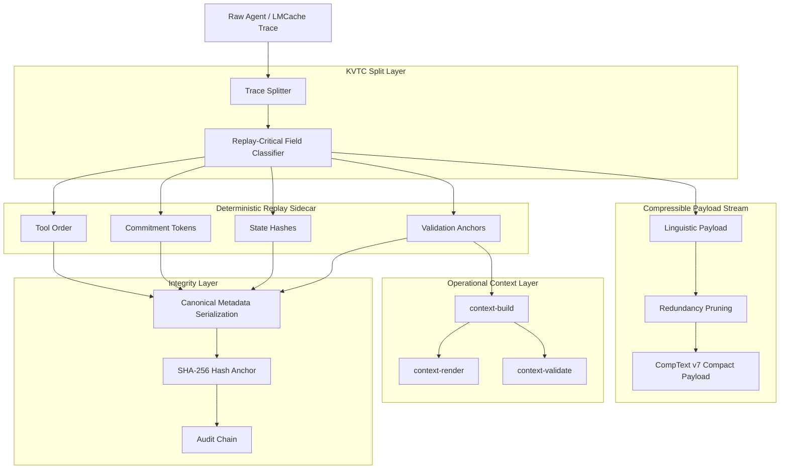
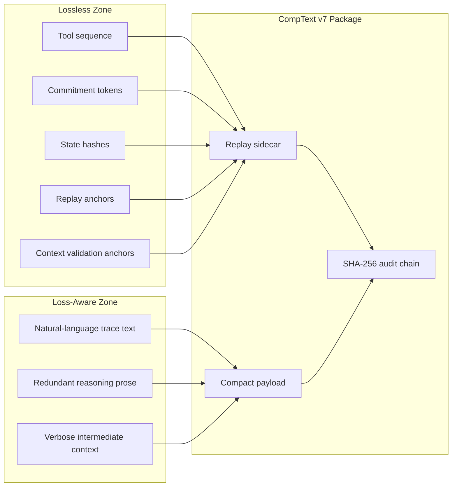

# 🚀 Antigravity × CompText v7

<div align="center">

[](https://github.com/ProfRandom92/Antigravity-Comptextv7/stargazers)
[](https://opensource.org/licenses/MIT)
[](https://www.python.org/)
[](https://www.rust-lang.org/)
[](#-security-model)
[](#-spark-hackathon-track)
[](#-contributing)

**Deterministic trace compression for autonomous agent systems.**

CompText v7 separates compressible linguistic payloads from replay-critical state, then reconstructs canonical traces with cryptographic sidecar integrity. The SPARK track adds an offline Rust path for packaging, schema checks, operational context generation, token-light rendering, and context validation.

[Overview](#-overview) • [SPARK Track](#-spark-hackathon-track) • [Operational Context Layer](#-operational-context-layer) • [Architecture](#-architecture) • [Rust Integration](#-rust-integration) • [Quickstart](#-quickstart)

</div>

---

## ✨ Overview

**Antigravity × CompText v7** is a KVTC-style core engine for deterministic trace compression and replay-oriented reconstruction in autonomous multi-agent systems.

The central idea is simple:

> Compress what is linguistically redundant. Preserve what is operationally decisive.

Classic lossy trace compression fails when validators expect exact tool order, commitment tokens, state hashes, and canonical replay strings. CompText v7 avoids that failure mode by splitting each trace into two coordinated streams:

| Layer | Purpose | Target property |
|---|---|---|
| **CompText payload** | Pruned, compact linguistic trace | Lower token and transport cost |
| **Replay sidecar** | Tool sequence, commitments, hashes, state anchors | Deterministic reconstruction in the validated scope |
| **SHA-256 audit chain** | Integrity metadata over critical replay data | Tamper-sensitive validation |
| **Holdout validator** | Non-adaptive replay verification | Stable replay score in benchmark runs |

---

## 🏛 SPARK Hackathon Track

**SPARK-style extraction packaging for offline audit workflows.**

This repository contains the SPARK Hackathon integration track for applying CompText v7 design patterns to audit-safe administrative AI workflows. The target use case is deterministic packaging of SPARK-style extraction outputs so that structured results from planning and approval procedures can be verified, replayed, schema-checked, and summarized without reconstructing raw payload content.

The SPARK track focuses on the **Safe and Stable** challenge:

- wrap SPARK-style extractor JSON into a deterministic CompText v7 package
- preserve replay-critical fields in a sidecar instead of compressing them away
- anchor packages with SHA-256 integrity metadata
- provide offline `verify`, `replay`, and `schema-check` flows for authority-controlled deployments
- provide an offline operational context layer for build/render/validate workflows
- demonstrate tamper-sensitive checks against modified extraction fields, metadata, and state hashes

The Rust deliverable lives under `agy7rust/` and exposes the CLI path for SPARK-style packaging:

```bash
cd agy7rust
cargo run -- compress -i ../examples/spark/extraction.json -o ../artifacts/spark/extraction.spkg
cargo run -- inspect  -i ../artifacts/spark/extraction.spkg
cargo run -- verify   -i ../artifacts/spark/extraction.spkg
cargo run -- replay   -i ../artifacts/spark/extraction.spkg
cargo run -- adversarial -i ../examples/spark/extraction.json
cargo run -- schema-check -i ../examples/spark/extraction.json -s ../schemas/genehmigung_v1.json
```

For the hackathon demo, the minimum proof is simple: the same SPARK-style extraction input produces the same package bytes in the validated scope, valid packages replay deterministically in that scope, and unauthorized mutation fails verification before it can become a misleading administrative artifact.

---

## 🧩 Operational Context Layer

Phase 3 adds the SPARK operational context layer. It is intentionally offline and narrow: it does not add MCP server behavior, RAG, embeddings, a vector database, external tool orchestration, or official SPARK compatibility claims.

The layer is split into four completed slices:

| Phase | Capability | Main outputs |
|---|---|---|
| **3A** | Context model | `OperationalContext`, dependency edges, validation metadata |
| **3B** | Context build | `artifacts/spark/context.json` |
| **3C** | Context render | `artifacts/spark/context_render.txt` |
| **3D** | Context validate | structural and configured leak-boundary checks |

Run from `agy7rust/`:

```bash
cargo run -- context-build -i ../artifacts/spark/extraction.spkg -s ../schemas/genehmigung_v1.json -o ../artifacts/spark/context.json
cargo run -- context-render -i ../artifacts/spark/context.json -o ../artifacts/spark/context_render.txt
cargo run -- context-validate -i ../artifacts/spark/context.json
```

Phase 3 handoff artifacts:

- `PHASE3_CONTEXT_LAYER_PLAN.md`
- `PHASE3A_CONTEXT_MODEL_SNAPSHOT.md`
- `PHASE3B_CONTEXT_BUILD_HANDBOOK.md`
- `PHASE3B_CONTEXT_BUILD_SNAPSHOT.md`
- `PHASE3C_CONTEXT_RENDER_HANDBOOK.md`
- `PHASE3C_CONTEXT_RENDER_SNAPSHOT.md`
- `PHASE3D_CONTEXT_VALIDATE_HANDBOOK.md`
- `PHASE3D_CONTEXT_VALIDATE_SNAPSHOT.md`
- `PHASE3_CONTEXT_LAYER_FINAL_SNAPSHOT.md`
- `PHASE3_GITHUB_HANDOFF.md`

Validation recorded before handoff:

```bash
cargo fmt --all --check
cargo check
cargo test
cargo clippy -- -D warnings
cargo run -- context-build -i ../artifacts/spark/extraction.spkg -s ../schemas/genehmigung_v1.json -o ../artifacts/spark/context.json
cargo run -- context-render -i ../artifacts/spark/context.json -o ../artifacts/spark/context_render.txt
cargo run -- context-validate -i ../artifacts/spark/context.json
cargo run -- schema-check -i ../examples/spark/extraction.json -s ../schemas/genehmigung_v1.json
powershell -File ./demo_spark.ps1
```

Observed in the validated local scope: `cargo test` passed 27/27 tests, offline behavior was deterministic in the validated test scope, and configured leak checks passed in the validated scope.

---

## 🧠 Why this exists

Agent traces are not normal text. They contain natural language, tool calls, hidden sequencing assumptions, external state references, and validation-sensitive tokens. If all of that is compressed as plain prose, replay integrity collapses.

CompText v7 treats agent traces as structured artifacts:

- **Payload text** can be reduced aggressively.
- **Replay-critical state** is isolated in deterministic metadata.
- **Integrity anchors** make silent mutation detectable.
- **Canonical reconstruction** keeps validation independent from stochastic LLM recovery.

---

## 🗺 Architecture

CompText v7 is built around one hard rule: **payload compression must never destroy replay-critical state**.



### Compression contract



---

## 🦀 Rust Integration

Rust is integrated as the execution path for the parts that should be fast, deterministic in the validated scope, and easy to audit:

- byte-level payload handling
- deterministic hashing and verification
- replay-sidecar validation
- schema-sidecar validation
- operational context build/render/validate flows
- low-overhead execution inside local validation workflows

Python remains useful as the reference and experimentation layer. Rust is the direction for hardened execution.

---

## 🔒 Security Model

CompText v7 does not treat compression as a purely cosmetic optimization. Every replay-sensitive field is part of the integrity surface.

The sidecar protects:

- tool execution order
- commitment and control tokens
- final state hash
- replay metadata
- validation-critical anchors
- context validation anchors

If a compressed package is modified without updating the expected integrity chain, reconstruction should fail loudly instead of producing a misleading replay.

Non-claims:

- no official SPARK compatibility claim
- no EU AI Act compliance claim
- no legal evidentiary-status claim
- no forensic certainty claim
- no MCP server capability
- no RAG, embeddings, vector database, or external tool-orchestration layer

---

## 📊 Benchmarks

Current validation targets are based on the existing CompText v7 benchmark profile:

| Group | Strategy | Avg. Payload | Replay Validity | Notes |
|---|---:|---:|---:|---|
| A | Raw baseline | 2023.9 bytes | 1.00 | No compression |
| B | CompText v7 | **744.4 bytes** | **1.00** | **63.2 % reduction** |
| C | Regex pruning | ~68 % of raw | 1.00 | No forensic integrity |
| D/E | Blind reduction | variable | 0.0 on complex traces | Loses temporal/state-critical tokens |

The design goal is not maximum textual compression at any cost. The goal is maximum safe reduction under strict deterministic replay constraints.

---

## 📦 Repository Map

```text
.
├── .agent/                 # Local agent skills used for gated implementation
├── .antigravitycli/        # Antigravity CLI/runtime configuration
├── Comptextv7/             # CompText v7 integration surface
├── agy7rust/               # Rust CLI path for SPARK-style packaging and context flows
├── artifacts/spark/        # Generated SPARK demo/package/context artifacts
├── benchmarks/             # Benchmark profiles and comparison material
├── core/                   # KVTC / replay core components
├── datasets/               # Fixtures and trace datasets
├── examples/spark/         # SPARK-style extraction fixtures and demo input
├── reports/                # Evaluation notes and generated reports
├── schemas/                # JSON schema sidecar fixtures
├── tests/                  # Holdout, replay, and integrity tests
└── README.md               # Project landing page
```

---

## ⚡ Quickstart

Clone the repository:

```bash
git clone https://github.com/ProfRandom92/Antigravity-Comptextv7.git
cd Antigravity-Comptextv7
```

Run the Python validation suite:

```bash
python -m pytest
```

Run the Rust path:

```bash
cd agy7rust
cargo test
cargo build --release
```

SPARK package demo:

```bash
cargo run -- compress -i ../examples/spark/extraction.json -o ../artifacts/spark/extraction.spkg
cargo run -- verify   -i ../artifacts/spark/extraction.spkg
cargo run -- replay   -i ../artifacts/spark/extraction.spkg
cargo run -- schema-check -i ../examples/spark/extraction.json -s ../schemas/genehmigung_v1.json
```

SPARK context demo:

```bash
cargo run -- context-build -i ../artifacts/spark/extraction.spkg -s ../schemas/genehmigung_v1.json -o ../artifacts/spark/context.json
cargo run -- context-render -i ../artifacts/spark/context.json -o ../artifacts/spark/context_render.txt
cargo run -- context-validate -i ../artifacts/spark/context.json
```

Full Rust validation checklist:

```bash
cargo fmt --all --check
cargo check
cargo test
cargo clippy -- -D warnings
powershell -File ./demo_spark.ps1
```

---

## 🧪 What to test before opening a PR

Before submitting changes, verify that your patch does not weaken replay determinism or context-layer boundaries:

```bash
python -m pytest
cd agy7rust
cargo fmt --all --check
cargo check
cargo test
cargo clippy -- -D warnings
```

Recommended checks:

- compressed payload stays smaller than raw baseline
- replay reconstruction remains canonical in the validated scope
- sidecar hash validation catches mutation
- schema-sidecar validation still rejects missing required fields
- context rendering remains token-light
- configured leak checks continue to pass
- benchmark outputs are reproducible
- SPARK-style extraction fixtures verify, replay, and context-validate deterministically in the validated test scope

---

## 🤝 Contributing

Contributions are welcome. The project is especially interested in work that improves determinism, compression quality, auditability, Rust hardening, or SPARK-style administrative AI verification.

Good first contribution areas:

- add new trace fixtures
- add SPARK-style extraction fixtures
- improve benchmark coverage
- document edge cases
- add Rust-side validation tests
- tighten schema-sidecar checks
- improve CI reproducibility
- extend operational context validation while preserving leak boundaries

Contribution flow:

1. Fork the repository.
2. Create a feature branch: `git checkout -b feature/your-improvement`.
3. Make a focused change.
4. Run tests locally.
5. Open a pull request with a clear before/after explanation.

Please keep PRs small, reproducible, and validation-oriented.

---

## 🛣 Roadmap

- [x] Deterministic replay-sidecar architecture
- [x] SHA-256 integrity anchoring
- [x] Holdout-oriented validation profile
- [x] Rust execution path introduced
- [x] SPARK-style extraction package format
- [x] Schema-driven sidecar extraction
- [x] Offline SPARK demo fixtures
- [x] SPARK operational context model
- [x] SPARK context build/render/validate CLI flow
- [ ] CI benchmark snapshots
- [ ] Fresh-clone GitHub verification workflow
- [ ] Public examples for custom trace datasets
- [ ] v8 generalization layer for enterprise agent pipelines

---

## 🌟 Support the project

If this project helps you reason about safer agent traces, compression, or deterministic replay, consider leaving a star. It makes the project easier to discover and helps attract contributors who care about reliable agent infrastructure.

---

## 📄 License

This project is released under the MIT License.

---

<div align="center">

**CompText v7: compress the noise, preserve the proof.**

</div>
