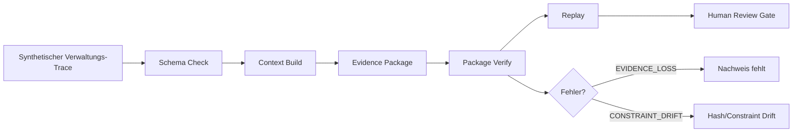

# Sparkctl

**Lokaler Prototyp im Kontext des BMDS/SPARK-Hackathons: Evidence-, Replay- und Validierungsschicht für SPARK-artige Verwaltungs-KI-Workflows.**

---

## Status und Eigenschaften

- **Typ:** Prototyp / Konzept-Demo
- **Datenbasis:** Rein synthetisch (*Synthetic-only*)
- **Freigabe:** Erfordert menschliche Prüfung (*Human Review Required / Human-in-the-Loop*)
- **Technologie:** Rust CLI (`agy-ct` und `sparkctl`)
- **Architektur:** Lokal-first (*Local-first / Offline*)
- **Einschränkung:** Keine Aussage zur Produktivreife, Rechtskonformität oder behördlichen Zertifizierung (*No production/legal/compliance claims*)

*Kernsatz: Modelle sind Provider, Kontext ist das Produkt.*

---

## Architektur-Übersicht



---

## Warum relevant für den SPARK-Hackathon?

Der SPARK-Hackathon („Schnellere Planung und Realisierung durch KI“) sucht nach Wegen, Verwaltungsverfahren mithilfe von KI-Systemen sicherer und effizienter zu gestalten. 

**Sparkctl** greift hierbei an einer kritischen Stelle an:
- **Keine autonome Entscheidung:** Das Tool trifft keine eigenen inhaltlichen oder rechtlichen Entscheidungen.
- **Kontext-Sicherung:** Es sorgt dafür, dass die an KI-Modelle übergebenen Kontextdaten (Traces) strukturiert, reproduzierbar und für den menschlichen Bearbeiter vollständig nachvollziehbar bleiben.
- **Prüfbarkeit:** Durch die Trennung von komprimierbarem Fließtext und aufzeichnungsrelevanten Metadaten bleibt die Historie der Bearbeitungsschritte auditierbar.

Dies ermöglicht sichere, transparente und nachvollziehbare Prototyp-Workflows für die KI-gestützte Sachbearbeitung.

---

## Was der Prototyp lokal kann

Sparkctl implementiert folgende Mechanismen zur Absicherung synthetischer Planungsdaten:

- **Verify-before-Replay:** Vor jedem Replay-Durchlauf wird die strukturelle Integrität des Pakets verifiziert.
- **Fehlererkennung:**
  - `EVIDENCE_LOSS`: Erkennt, wenn für die Wiederholung notwendige Nachweise im Paket fehlen.
  - `CONSTRAINT_DRIFT`: Erkennt Manipulationen an Hashes oder verankerten Integritätsbedingungen.
- **Kryptografische Absicherung:** Nutzung von *canonical JSON* zur deterministischen Serialisierung und einer darauf aufbauenden *SHA-256 Hash-Chain* zur lückenlosen Protokollierung.
- **Grobübersicht der implementierten Befehle:**
  - `agy-ct package verify`: Prüft SHA-256 Signaturen und Verkettungen.
  - `agy-ct package replay`: Rekonstruiert die aufgezeichnete Trace deterministisch (strikte stdout/stderr Kanaltrennung).
  - `agy-ct package inspect`: Zeigt Metadaten und Header-Einträge.
  - `agy-ct schema check`: Abgleich von Traces gegen JSON-Schemas.
  - `agy-ct context validate`: Führt strukturelle Validierung und Leckprüfungen auf Kontextmodellen durch.
  - `agy-ct context build`: Erzeugt strukturierte operative Kontextmodelle.

---

## Quickstart (Lokal)

Führen Sie die folgenden sicheren lokalen Befehle im Rust-Unterverzeichnis aus:

```bash
# In das Rust-Verzeichnis wechseln
cd agy7rust

# Testsuite ausführen (67+ Tests)
cargo test

# Schema-Check mit synthetischen Beispieldaten ausführen
cargo run --bin agy-ct -- schema check --input ../examples/spark/extraction.json --schema ../schemas/genehmigung_v1.json
```

*Hinweis: Befehle, die Berichte oder veränderte Artefakte generieren, sind optional und dienen dem manuellen Review-Prozess.*

---

## Agenten-Setup & Governance

Dieses Repository nutzt klare Richtlinien für die lokale Ausführung von KI-Entwicklungsagenten (z. B. Antigravity):

- **Regelwerk:** Die [AGENTS.md](AGENTS.md) ist das maßgebliche lokale Steuerungswerkzeug.
- **Skill-Pfad:** Das Verzeichnis `.agents/skills/` dient als aktiver Antigravity-Skill-Pfad.
- **Codex-Hooks:** Skripte unter `.codex/hooks/` sind Codex-spezifisch und bieten keine Ausführungs- oder Sicherheitsgarantie für Antigravity-Sitzungen.
- **Sicherheits-Modus:** Empfohlen wird die Ausführung im Sandbox-Modus (`proceed-in-sandbox`).

---

## Grenzen und Non-Claims

Um Missverständnisse im Rahmen des SPARK-Hackathons auszuschließen, gelten folgende Grenzen:

- **Kein offizielles Produkt:** Sparkctl ist kein offizielles Produkt des BMDS (Bundesministerium für Digitales und Verkehr) oder seiner Partner.
- **Keine Produktivfreigabe:** Der Code ist ein reiner Prototyp für Testzwecke.
- **Keine Rechts- oder Compliance-Garantie:** Es wird keine rechtliche Beratung oder forensische Nachweissicherheit geboten.
- **Keine EU-AI-Act-Konformität:** Es wird keine Konformitätsbewertung oder Konformitätsgarantie nach dem EU AI Act gegeben.
- **Keine autonomen Entscheidungen:** Das System ersetzt zu keinem Zeitpunkt den menschlichen Review (*Mandatory Human-in-the-Loop*).
- **Keine Echtdaten:** Es werden ausschließlich künstliche (synthetische) Testdaten verarbeitet. Die Verarbeitung realer Bürger- oder Behördendaten ist ausgeschlossen.
- **Kein Diagnosefokus:** Legacy-Konzepte wie XENTRY, OBD-II oder X-Engine-Diagnoseschnittstellen sind ausdrücklich nicht Teil des aktiven SPARK-Scopes.

---

## Roadmap

### Aktuell Offen (Platzhalter-Befehle):
- `context render`: Generierung sprachlich reduzierter Zusammenfassungen.
- `package compress`: Algorithmen zur verlustbehafteten Trace-Kompression unter Beibehaltung kritischer Hashes.
- `package adversarial`: Robustheitstests gegen gezielte Manipulationen.

### Zukünftige Schritte:
- Erweiterung der synthetischen Planungs-Fixtures.
- Evaluierung von Community-Feedback zu Evidence-Strukturen.
- Optionale native Plugin- und Hook-Integrationen für verbesserte Absicherung.

---

## Community

- **Feedback & Issues:** Fragen, Anregungen oder Fehlerberichte zu den Prototypen sind via GitHub Issues willkommen.
- **Fokus auf Synthetik:** Bitte posten Sie in den Issues oder Diskussionen niemals echte Verwaltungs- oder Bürgerdaten. Verwenden Sie stets anonymisierte oder synthetische Beispieldaten.
