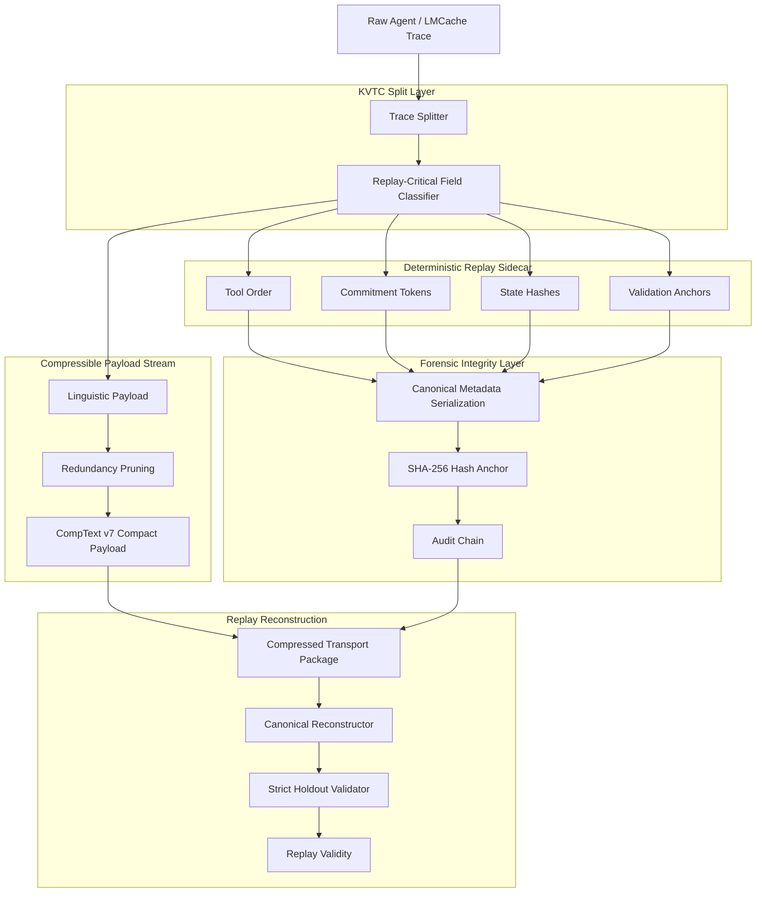
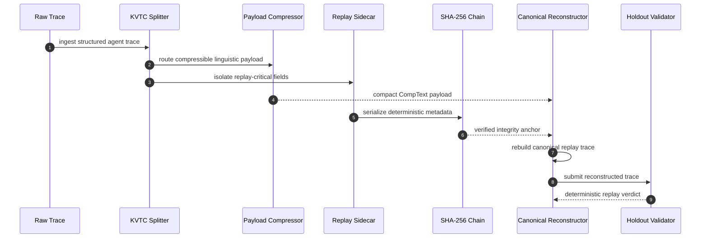
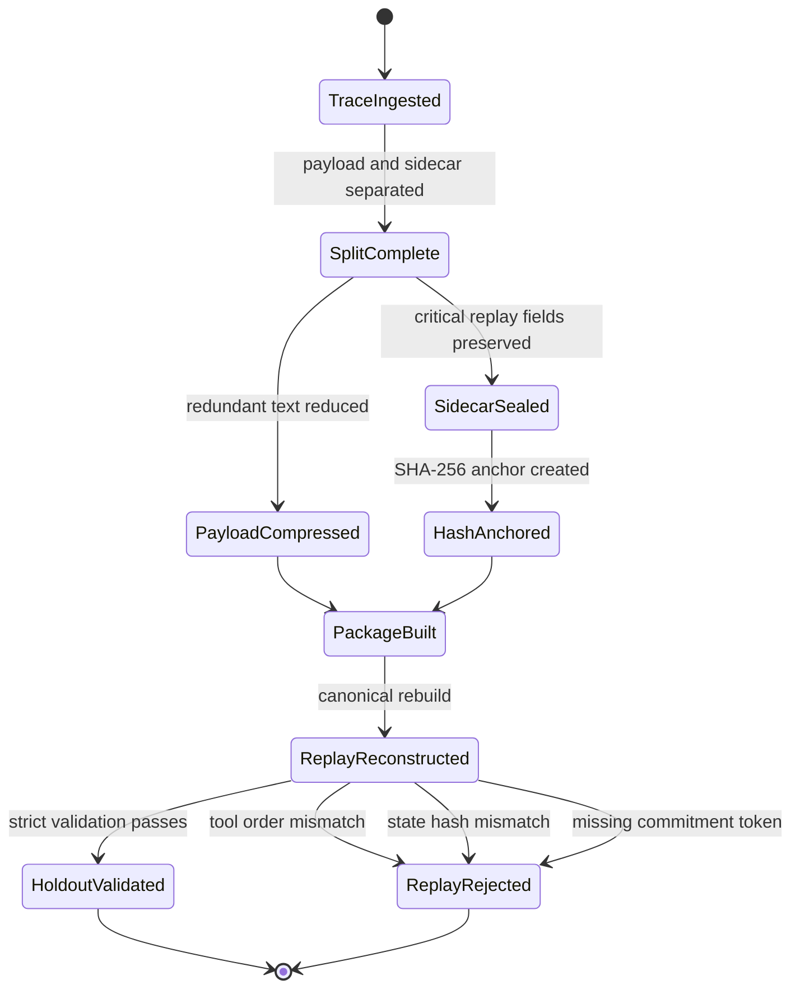
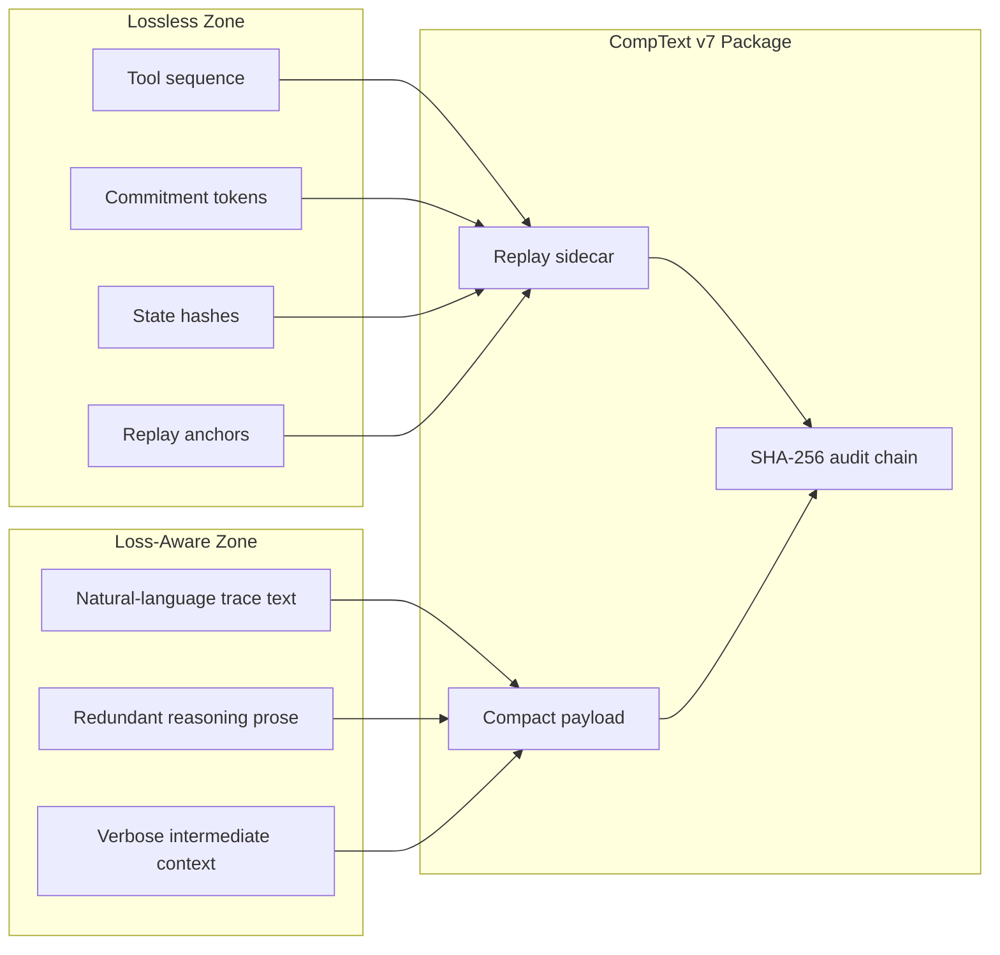
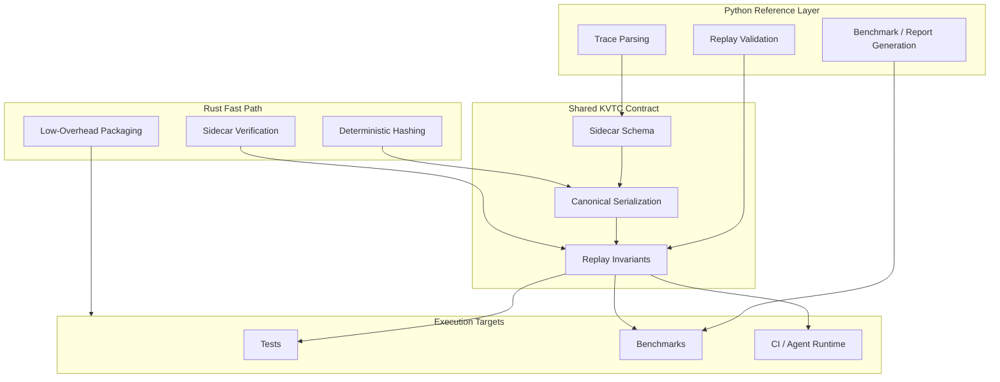

# 🚀 Antigravity × CompText v7

<div align="center">

[](https://github.com/ProfRandom92/Antigravity-Comptextv7/stargazers)
[](https://opensource.org/licenses/MIT)
[](https://www.python.org/)
[](https://www.rust-lang.org/)
[](#-security-model)
[](#-spark-hackathon-track)
[](#-contributing)

**Deterministic trace compression for autonomous agent systems.**

CompText v7 separates compressible linguistic payloads from replay-critical state, then reconstructs canonical traces with cryptographic sidecar integrity. The result is aggressive token reduction without sacrificing strict holdout validation.

[Overview](#-overview) • [SPARK Track](#-spark-hackathon-track) • [Architecture](#-architecture) • [Rust Integration](#-rust-integration) • [Benchmarks](#-benchmarks) • [Contributing](#-contributing)

</div>

---

## ✨ Overview

**Antigravity × CompText v7** is a KVTC-style core engine for deterministic trace compression and lossless replay reconstruction in autonomous multi-agent systems.

The central idea is simple:

> Compress what is linguistically redundant. Preserve what is operationally decisive.

Classic lossy trace compression fails when validators expect exact tool order, commitment tokens, state hashes, and canonical replay strings. CompText v7 avoids that failure mode by splitting each trace into two coordinated streams:

| Layer | Purpose | Guarantee |
|---|---|---|
| **CompText payload** | Pruned, compact linguistic trace | Lower token and transport cost |
| **Replay sidecar** | Tool sequence, commitments, hashes, state anchors | Deterministic reconstruction |
| **SHA-256 audit chain** | Integrity proof over critical replay metadata | Tamper detection |
| **Holdout validator** | Non-adaptive replay verification | Stable replay score |

---

## 🏛 SPARK Hackathon Track

**SPARK extracts. CompText v7 proves it.**

This repository now contains the SPARK Hackathon integration track for applying CompText v7 to audit-safe administrative AI workflows. The target use case is deterministic packaging of SPARK extraction outputs so that structured results from planning and approval procedures can be verified, replayed, and checked for silent mutation.

The SPARK track focuses on the **Safe and Stable** challenge:

- wrap SPARK-style extractor JSON into a deterministic CompText v7 package
- preserve replay-critical fields in a sidecar instead of compressing them away
- anchor every package with SHA-256 integrity metadata
- provide offline `verify` and `replay` flows suitable for authority-controlled deployments
- demonstrate tamper detection against modified extraction fields, metadata, and state hashes

The intended Rust deliverable lives under `agy7rust/` and acts as a hardened CLI path for SPARK-oriented packaging:

```bash
agy7rust compress --input examples/spark/extraction.json --output artifacts/spark/extraction.spkg
agy7rust inspect  --input artifacts/spark/extraction.spkg
agy7rust verify   --input artifacts/spark/extraction.spkg
agy7rust replay   --input artifacts/spark/extraction.spkg
agy7rust adversarial --input examples/spark/extraction.json
```

For the hackathon demo, the minimum proof is simple: same SPARK extraction input produces the same package bytes, valid packages replay deterministically, and any unauthorized mutation fails verification before it can become a misleading administrative artifact.

---

## 🧠 Why this exists

Agent traces are not normal text. They contain natural language, tool calls, hidden sequencing assumptions, external state references, and validation-sensitive tokens. If all of that is compressed as plain prose, replay integrity collapses.

CompText v7 treats agent traces as structured forensic artifacts:

- **Payload text** can be reduced aggressively.
- **Replay-critical state** is isolated in a deterministic sidecar.
- **Integrity anchors** make silent mutation detectable.
- **Canonical reconstruction** keeps validation independent from stochastic LLM recovery.

---

## 🗺 Architecture

CompText v7 is built around one hard rule: **payload compression must never destroy replay-critical state**.



### Replay lifecycle



### Integrity state machine



### Compression contract



---

## 🦀 Rust Integration

Rust is integrated as the performance-oriented execution path for the parts that should be fast, deterministic, and easy to audit:

- byte-level payload handling
- deterministic hashing and verification
- replay-sidecar validation
- future zero-copy trace packaging
- low-overhead execution inside CI or agent runtimes

Python remains useful as the reference and experimentation layer. Rust is the direction for hardened, production-grade execution.



---

## 🔒 Security Model

CompText v7 does not treat compression as a purely cosmetic optimization. Every replay-sensitive field is part of the integrity surface.

The sidecar protects:

- tool execution order
- commitment and control tokens
- final state hash
- replay metadata
- validation-critical anchors

If a compressed package is modified without updating the expected integrity chain, reconstruction should fail loudly instead of producing a misleading replay.

---

## 📊 Benchmarks

Current validation targets are based on the existing CompText v7 benchmark profile:

| Group | Strategy | Avg. Payload | Replay Validity | Notes |
|---|---:|---:|---:|---|
| A | Raw baseline | 2023.9 bytes | 1.00 | No compression |
| B | CompText v7 | **744.4 bytes** | **1.00** | **63.2 % reduction** |
| C | Regex pruning | ~68 % of raw | 1.00 | No forensic integrity |
| D/E | Blind reduction | variable | 0.0 on complex traces | Loses temporal/state-critical tokens |

The design goal is not maximum textual compression at any cost. The goal is **maximum safe reduction under strict deterministic replay constraints**.

---

## 📦 Repository Map

```text
.
├── .antigravitycli/       # Antigravity CLI/runtime configuration
├── Comptextv7/            # CompText v7 integration surface
├── agy7rust/              # Rust CLI path for SPARK-ready packaging, verify, replay
├── artifacts/             # Generated outputs and validation artifacts
├── benchmarks/            # Benchmark profiles and comparison material
├── core/                  # KVTC / replay core components
├── datasets/              # Fixtures and trace datasets
├── examples/spark/        # SPARK-style extraction fixtures and demo input
├── reports/               # Evaluation notes and generated reports
├── tests/                 # Holdout, replay, and integrity tests
└── README.md              # Project landing page
```

---

## ⚡ Quickstart

Clone the repository:

```bash
git clone https://github.com/ProfRandom92/Antigravity-Comptextv7.git
cd Antigravity-Comptextv7
```

Run the Python validation suite:

```bash
python -m pytest
```

When working on the Rust path, use the normal Rust toolchain from the Rust module location:

```bash
cd agy7rust
cargo test
cargo build --release
```

SPARK demo target:

```bash
cargo run -- compress -i ../examples/spark/extraction.json -o ../artifacts/spark/extraction.spkg
cargo run -- verify   -i ../artifacts/spark/extraction.spkg
cargo run -- replay   -i ../artifacts/spark/extraction.spkg
```

---

## 🧪 What to test before opening a PR

Before submitting changes, verify that your patch does not weaken replay determinism:

```bash
python -m pytest
cd agy7rust && cargo test
```

Recommended checks:

- compressed payload stays smaller than raw baseline
- replay reconstruction remains canonical
- sidecar hash validation catches mutation
- holdout validation remains stable
- benchmark outputs are reproducible
- SPARK-style extraction fixtures verify and replay deterministically

---

## 🤝 Contributing

Contributions are welcome. The project is especially interested in work that improves determinism, compression quality, auditability, Rust hardening, or SPARK-style administrative AI verification.

Good first contribution areas:

- add new trace fixtures
- add SPARK-style extraction fixtures
- improve benchmark coverage
- document edge cases
- add Rust-side validation tests
- tighten sidecar schema checks
- improve CI reproducibility

Contribution flow:

1. Fork the repository.
2. Create a feature branch: `git checkout -b feature/your-improvement`.
3. Make a focused change.
4. Run tests locally.
5. Open a pull request with a clear before/after explanation.

Please keep PRs small, reproducible, and validation-oriented.

---

## 🛣 Roadmap

- [x] Deterministic replay-sidecar architecture
- [x] SHA-256 integrity anchoring
- [x] Holdout-oriented validation profile
- [x] Rust execution path introduced
- [ ] SPARK-style extraction package format
- [ ] Schema-driven sidecar extraction
- [ ] Rust-first replay validator
- [ ] Offline SPARK demo fixtures
- [ ] CI benchmark snapshots
- [ ] Public examples for custom trace datasets
- [ ] v8 generalization layer for enterprise agent pipelines

---

## 🌟 Support the project

If this project helps you reason about safer agent traces, compression, or deterministic replay, consider leaving a star. It makes the project easier to discover and helps attract contributors who care about reliable agent infrastructure.

---

## 📄 License

This project is released under the MIT License.

---

<div align="center">

**CompText v7: compress the noise, preserve the proof.**

</div>
