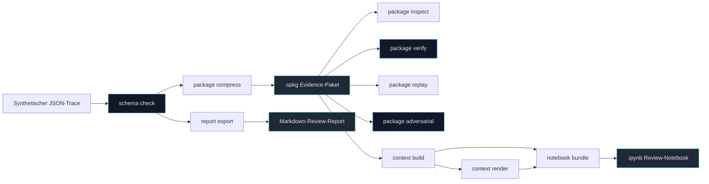
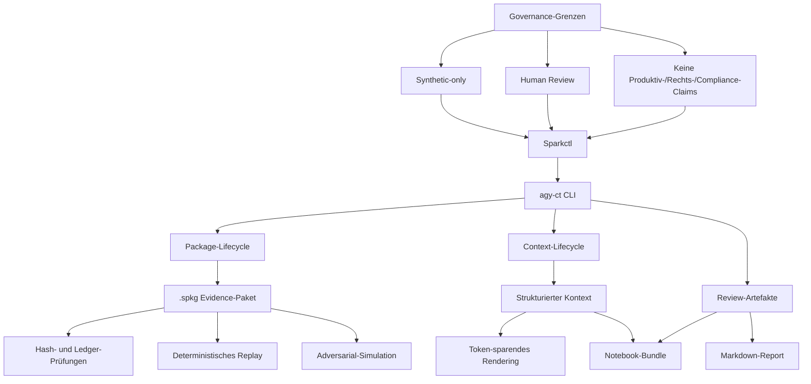
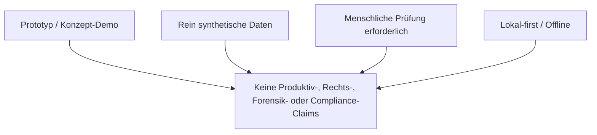

# Sparkctl


**Lokale Rust-CLI für synthetische Evidence-Pakete, deterministisches Replay, Kontext-Rendering und überprüfbare KI-Workflow-Artefakte.**

**Prototyp im Kontext des BMDS/SPARK-Hackathons: Evidence-, Replay- und Validierungsschicht für SPARK-artige Verwaltungs-KI-Workflows.**

> Modelle sind Provider. Kontext ist das Produkt.

---

## Snapshot

| Dimension | Sparkctl-Scope |
|---|---|
| **Typ** | Prototyp / Konzept-Demo |
| **Datenbasis** | Rein synthetisch (*Synthetic-only*) |
| **Freigabe** | Erfordert menschliche Prüfung (*Human Review Required / Human-in-the-Loop*) |
| **Technologie** | Rust CLI (`agy-ct` und `sparkctl`) |
| **Architektur** | Lokal-first (*Local-first / Offline*) |
| **Einschränkung** | Keine Aussage zur Produktivreife, Rechtskonformität oder behördlichen Zertifizierung (*No production/legal/compliance claims*) |

---

## Architektur-Übersicht



---

## Evidence-Workflow als Wissensgraph

Sparkctl lässt sich als kleiner Evidence-Graph lesen:



Dieser Graph ist bewusst README-nativ gehalten. Eine interaktive Ace-Knowledge-Graph-Variante kann später aus derselben Struktur generiert werden; die README bleibt jedoch ohne externe Runtime vollständig lesbar.

---

## Warum relevant für den SPARK-Hackathon?

Der SPARK-Hackathon („Schnellere Planung und Realisierung durch KI“) sucht nach Wegen, Verwaltungsverfahren mithilfe von KI-Systemen sicherer und effizienter zu gestalten. 

**Sparkctl** greift hierbei an einer kritischen Stelle an:
- **Keine autonome Entscheidung:** Das Tool trifft keine eigenen inhaltlichen oder rechtlichen Entscheidungen.
- **Kontext-Sicherung:** Es sorgt dafür, dass die an KI-Modelle übergebenen Kontextdaten (Traces) strukturiert, reproduzierbar und für den menschlichen Bearbeiter vollständig nachvollziehbar bleiben.
- **Prüfbarkeit:** Durch die Trennung von komprimierbarem Fließtext und aufzeichnungsrelevanten Metadaten bleibt die Historie der Bearbeitungsschritte auditierbar.

Dies ermöglicht sichere, transparente und nachvollziehbare Prototyp-Workflows für die KI-gestützte Sachbearbeitung.

---

## Was der Prototyp lokal kann

Sparkctl implementiert Mechanismen zur Absicherung synthetischer Planungsdaten. 

### Implementierte Befehle:
- **`agy-ct package compress`** — Komprimiert Roh-Traces zu einer `.spkg`-Datei unter Erhalt kritischer Hashes.
- **`agy-ct package inspect`** — Liest Sidecar-Eigenschaften und Header-Einträge aus `.spkg`.
- **`agy-ct package verify`** — Führt kryptografische SHA-256 Validierungen von `.spkg`-Evidence-Paketen durch.
- **`agy-ct package replay`** — Rekonstruiert die aufgezeichnete Trace deterministisch (strikte stdout/stderr Kanaltrennung).
- **`agy-ct package adversarial`** — Simuliert manipulierte Attribute zur Überprüfung der Manipulationserkennung.
- **`agy-ct report export`** — Exportiert JSON-Pipeline-Berichte als formatierten Markdown-Report.
- **`agy-ct notebook bundle`** — Bündelt Kontext-Zustände und Textrenderings in ein `.ipynb` Jupyter Notebook.
- **`agy-ct schema check`** — Gleicht rohe Trace-Dateien gegen JSON-Schemas ab.
- **`agy-ct context validate`** — Führt strukturelle Validierung und Leckprüfungen auf Kontextmodellen durch.
- **`agy-ct context build`** — Erzeugt strukturierte operative Kontextmodelle.
- **`agy-ct context render`** — Rendert operative Kontextdaten in token-sparenden Fließtext.

### Command Status Matrix

| Bereich | Befehl | Backend/Modul | Status | Output | Teststatus |
|---|---|---|---|---|---|
| **Package** | `package compress` | `compress::run` | Wired | `.spkg` Evidence-Paket | 100% PASS |
| **Package** | `package inspect` | `inspect::run` | Wired | Eigenschafts-Zusammenfassung | 100% PASS |
| **Package** | `package verify` | `verify_cmd::run` | Wired | Signatur-/Hash-Status | 100% PASS |
| **Package** | `package replay` | `replay_cmd::run` | Wired | Trace-Rekonstruktion (stdout/stderr) | 100% PASS |
| **Package** | `package adversarial` | `adversarial::run` | Wired | Manipulationserkennungs-Bericht | 100% PASS |
| **Schema** | `schema check` | `schema_check::run` | Wired | Validierungsergebnis | 100% PASS |
| **Context** | `context build` | `context_build::run` | Wired | Operatives Kontextmodell (JSON) | 100% PASS |
| **Context** | `context render` | `context_render::run` | Wired | Token-reduzierter Text | 100% PASS |
| **Context** | `context validate` | `context_validate::run` | Wired | Leck- und Strukturprüfungsbericht | 100% PASS |
| **Report** | `report export` | `report_export::run` | Wired | Markdown-Export (`.md`) | 100% PASS |
| **Notebook** | `notebook bundle` | `notebook_bundle::run` | Wired | `.ipynb` Jupyter Notebook | 100% PASS |

---

## Quickstart (Lokal)

Führen Sie die folgenden sicheren lokalen Befehle im Rust-Unterverzeichnis aus:

```bash
# In das Rust-Verzeichnis wechseln
cd agy7rust

# Testsuite ausführen
cargo test

# Berichtsexport mit einer synthetischen Beispieldokumentation ausführen
cargo run --bin agy-ct -- report export -i ../examples/spark/report_sample.json -o ../temp_output.md
```

*Hinweis: Befehle, die Berichte oder veränderte Artefakte generieren, sind optional und dienen dem manuellen Review-Prozess.*

---

## Kryptografische Absicherung und Integrität

Sparkctl nutzt eine Reihe technischer Mechanismen, um die Integrität synthetischer Planungsdaten nachzuweisen:
- **Canonical JSON:** Um Abweichungen durch Formatierung, Leerzeichen oder Keys-Sortierung zu verhindern, werden JSON-Strukturen deterministisch sortiert und serialisiert.
- **SHA-256 Hashing:** Die Verifikation stützt sich auf SHA-256 Hashes der serialisierten Daten.
- **Integrity Chain:** Der Hash des Preimages (`payload_sha256`) wird mit dem Zustand des Sidecars verknüpft, um ein manipulationssensitives Evidence Package zu erzeugen.
- **Adversarial-Simulation:** Der `package adversarial`-Befehl simuliert gezielte Manipulationen an Paketstrukturen, um zu demonstrieren, wie Abweichungen vom kanonischen Hash sofort erkannt werden.
- **Keine Sicherheits- oder Rechtsgarantie:** Diese Absicherung dient ausschließlich der Erkennung unbeabsichtigter Datenverluste oder struktureller Abweichungen (*tamper-sensitive validation*). Sie stellt keine kryptografische Signatur im Sinne des Signaturgesetzes und kein forensisch unumstößliches Beweismittel dar.

---

## Grenzen und Non-Claims

Um Missverständnisse im Rahmen des SPARK-Hackathons auszuschließen, gelten folgende Grenzen:



### Matrix der Non-Claims

| Eigenschaft | Scope-Abgrenzung / Non-Claim |
|---|---|
| **Einsatzbereich** | Kein Produktivsystem. Reine Prototyp- & Konzept-Demo. |
| **Rechtskonformität** | Keine Rechtsberatung, rechtliche Zertifizierung oder forensische Absicherung. |
| **Konformitätsstufe** | Keine amtliche Konformität (z. B. EU AI Act). Nur Unterstützung des Art.-12-orientierten Record-Keeping. |
| **Systemzugehörigkeit** | Kein offizielles BMDS-Produkt und keine offizielle SPARK-Konformitätsgarantie. |
| **Datenbasis** | Ausschließlich synthetische Testdaten. Verarbeitung von Echtdaten ist ausgeschlossen. |
| **Entscheidungskompetenz** | Keine autonome Entscheidungsfindung. Ein menschlicher Review ist zwingend erforderlich (*Human-in-the-Loop*). |

---

## Agenten-Setup & Governance

Dieses Repository nutzt klare Richtlinien für die lokale Ausführung von KI-Entwicklungsagenten (z. B. Antigravity):

- **Regelwerk:** Die [AGENTS.md](AGENTS.md) ist das maßgebliche lokale Steuerungswerkzeug.
- **Skill-Pfad:** Das Verzeichnis `.agents/skills/` dient als aktiver Antigravity-Skill-Pfad.
- **Codex-Hooks:** Skripte unter `.codex/hooks/` sind Codex-spezifisch und bieten keine Ausführungs- oder Sicherheitsgarantie für Antigravity-Sitzungen.
- **Sicherheits-Modus:** Empfohlen wird die Ausführung im Sandbox-Modus (`proceed-in-sandbox`).

---

## Roadmap

### Aktuell Offen (Platzhalter-Befehle):
- Keine bekannten CLI-Platzhalter mehr.

### Zukünftige Schritte:
- Erweiterung der synthetischen Planungs-Fixtures.
- Evaluierung von Community-Feedback zu Evidence-Strukturen.
- Optionale native Plugin- und Hook-Integrationen für verbesserte Absicherung.
- Optionaler Repo-Hygiene-Fix für alte Submodule-/Workflow-Warnungen.

---

## Community

- **Feedback & Issues:** Fragen, Anregungen oder Fehlerberichte zu den Prototypen sind via GitHub Issues willkommen.
- **Fokus auf Synthetik:** Bitte posten Sie in den Issues oder Diskussionen niemals echte Verwaltungs- oder Bürgerdaten. Verwenden Sie stets anonymisierte oder synthetische Beispieldaten.