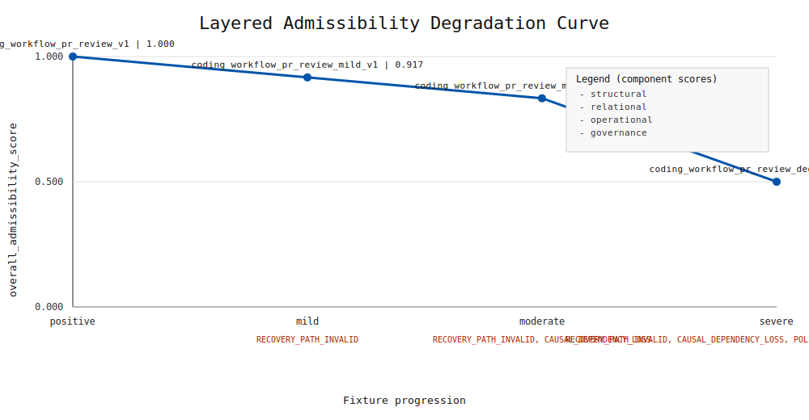

# Layered Admissibility Degradation Benchmark

## Purpose

Deterministically compare admissibility outcomes across fixture bundles using ContractValidator and AdmissibilityScorer.

All benchmarked fixtures are indexed in `fixtures/manifest.json` and benchmark artifact references should resolve only to registered manifest entries.

## Fixture results

| fixture_id | expected_admissible | observed_admissible | structural_score | relational_score | operational_score | governance_score | overall_admissibility_score | failure_labels |
| --- | --- | --- | --- | --- | --- | --- | --- | --- |
| coding_workflow_pr_review_v1 | true | true | 1.000 | 1.000 | 1.000 | 1.000 | 1.000 | none |
| coding_workflow_pr_review_mild_v1 | false | false | 1.000 | 0.667 | 1.000 | 1.000 | 0.917 | RECOVERY_PATH_INVALID |
| coding_workflow_pr_review_moderate_v1 | false | false | 1.000 | 0.333 | 1.000 | 1.000 | 0.833 | CAUSAL_DEPENDENCY_LOSS, RECOVERY_PATH_INVALID |
| coding_workflow_pr_review_degraded_v1 | false | false | 1.000 | 0.000 | 0.000 | 1.000 | 0.500 | CAUSAL_DEPENDENCY_LOSS, INVARIANT_VIOLATION, POLICY_ORDER_BROKEN, RECOVERY_PATH_INVALID |

## Interpretation

- positive fixture remains fully admissible
- mild fixture isolates recovery reachability loss
- moderate fixture combines recovery and causality loss
- severe fixture combines relational and operational failures

## Non-goals

- no LLM judges
- no embeddings
- no fuzzy matching
- no semantic equivalence

## Visualization

This SVG is a deterministic benchmark artifact generated directly from `artifacts/layered_admissibility_results.json` via the hand-written renderer (`src/visualization/svg_curve_renderer.py`). Rendering is pure SVG text generation with fixed canvas geometry, stable ordering, and fixed float precision (three decimals), so output is CI-friendly and reproducible with no stochastic rendering.

## Future

- add more fixture families
- extend deterministic benchmark artifacts
- keep visualization static and reproducible
